# How to use Git


<details>
<summary><h2>Install Git</h2></summary>
<br>
     
1. To install Git visit - https://git-scm.com/
2. Follow the below steps for the installation

      
     
     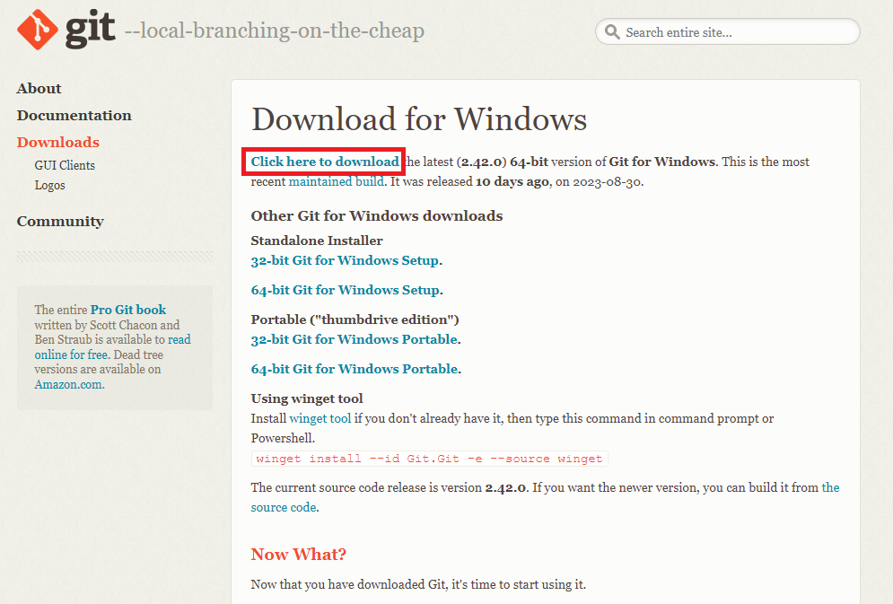

     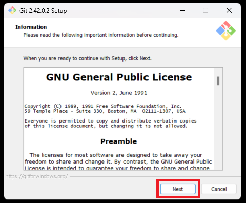

     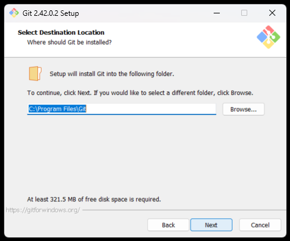

     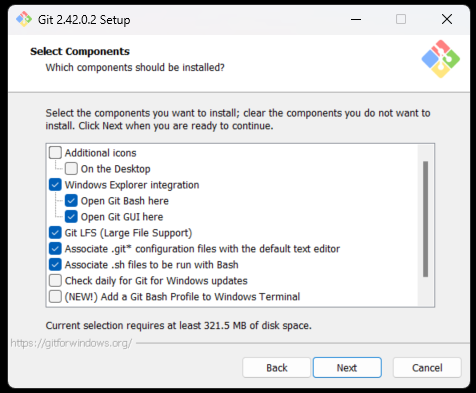
 
     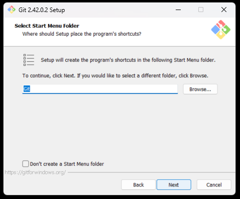

     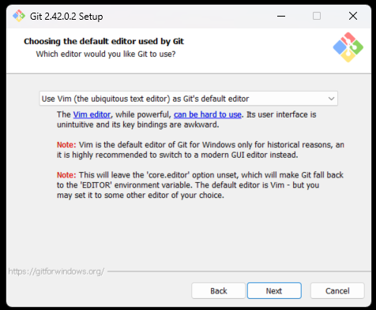

     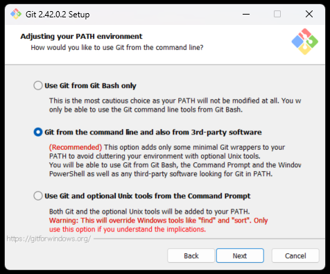

     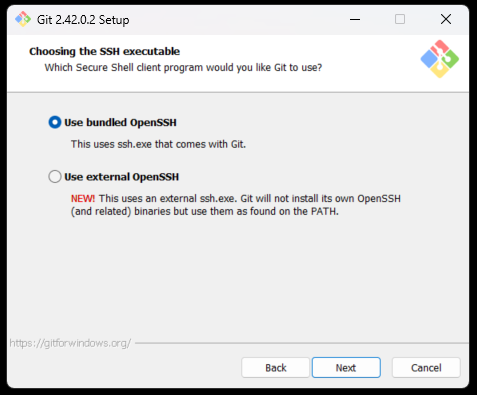

     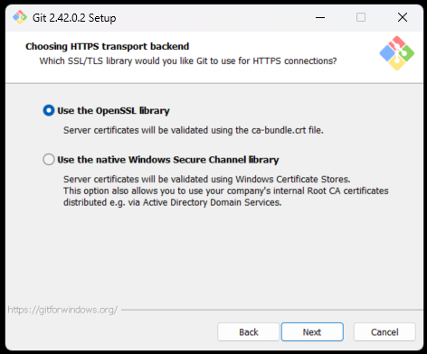

     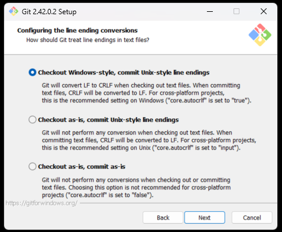

     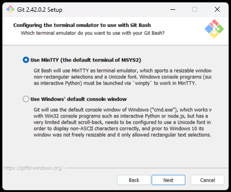

     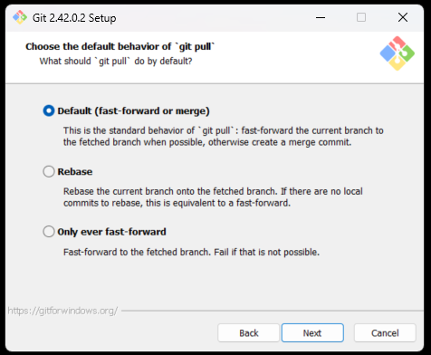

     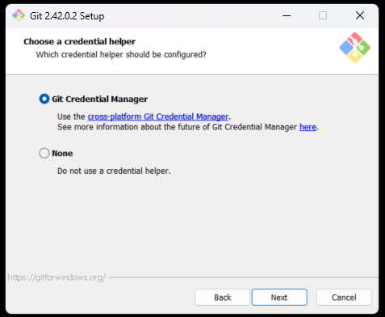

     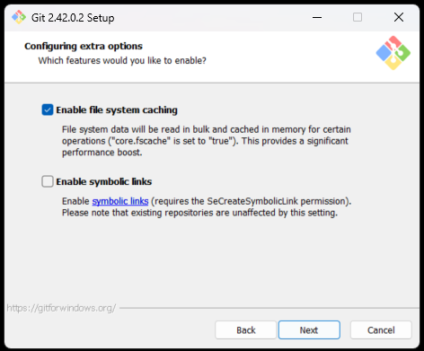

     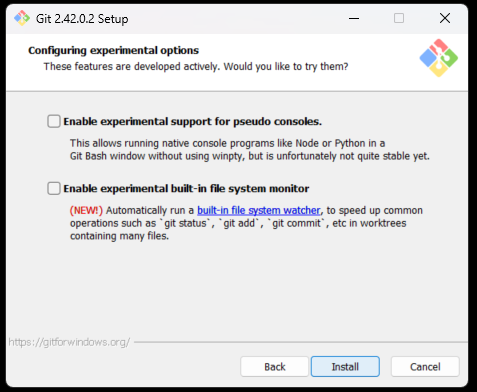
     
     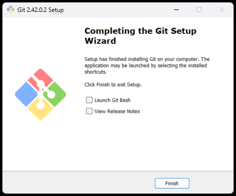
</details>

##

<details>
<summary><h2>Connect Git with GitHub</h2></summary>
<br>

hey
hey
hey
</details>

##

<details>
<summary><h2>Git commands</h2></summary>
<br>

1. Create a folder on your Desktop named "test"

2. Right click on it and select "Git Bash Here"

   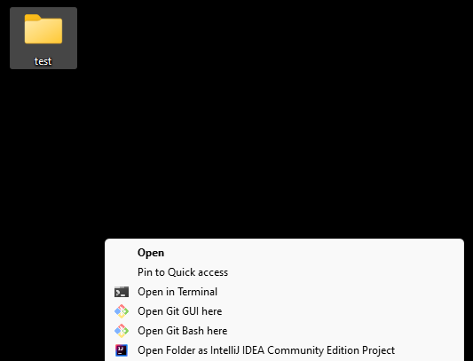

4. Open the folder "test"

5. In the Git console write the command
   ```
   git init
   ```
   This command created a Local repository on your PC
   
   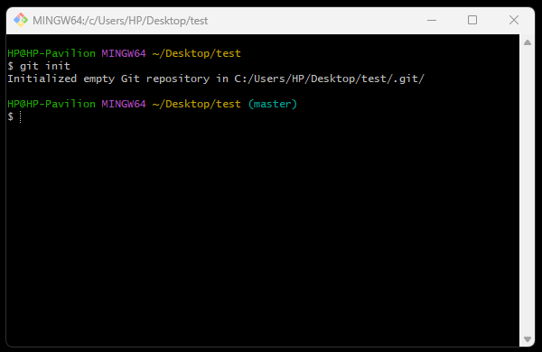

5. Create "file-1.txt" in the "test" folder 
   ```
   touch file-1.txt
   ```
   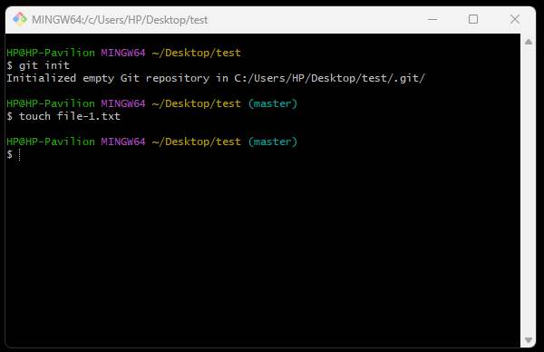

6. Lets check the status of our Local repository
   ```
   git status
   ```
   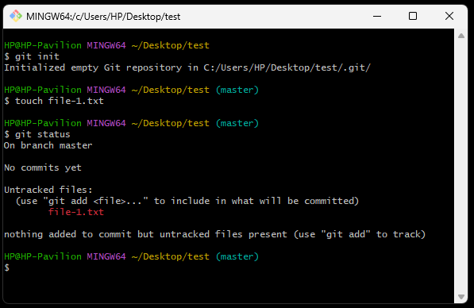

   From the result we got, it can be seen that we don't have any commits and we have 1 untracked files.

7. As mentioned in the result we got from the previous point we need to use:
   ```
   git add file-1.txt
   ```
   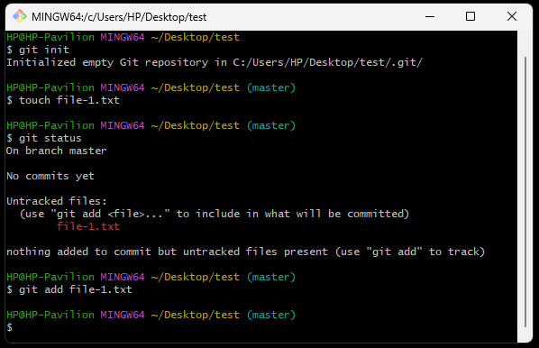

8. Lets check the status again
   ```
   git status
   ```
   
   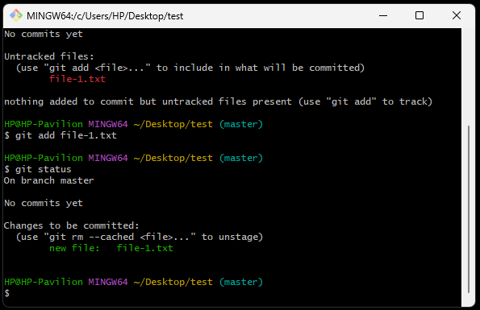

9. Commit the changes
   ```
   git commit -m "Add text file"
   ```
   ```
   git commit -m "[Message]"
   ```

   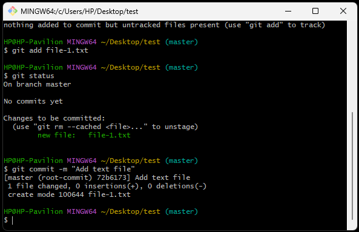
   
   From the above message we can see that we have added a new commit call "Add text file" and we have changed 1 file(file-1.txt)

10. Check the status
    ```
    git status
    ```
    
    

    When we see the above message, that means we are ready to the push the changes and add them to the Remove repository.

11. Add some text to file-1.txt
    ```
    echo "Sofia" >> file-1.txt
    ```

    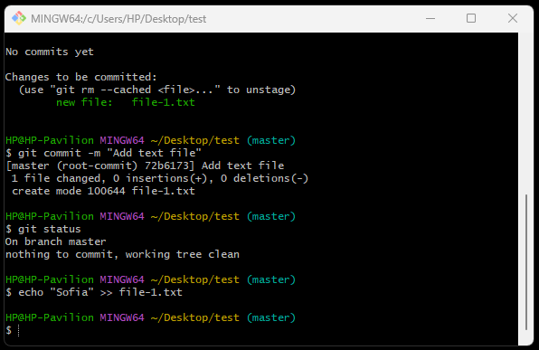

12. You can clear your console using
    ```
    clear
    ```

13. After adding text to file-1.txt, check the status
    ```
    git status
    ```

    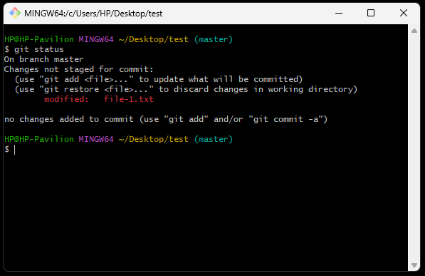

    From the above message we can either prepare our changes for commit or discard the changes we have made.
    If we want to restore the previous state of the file we have to use:
    ```
    git restore file-1.txt
    ```

    If we want to keep the changes we made and prepare them for commit we have to use:
    ```
    git add file-1.txt
    ```
    With this command we can add 1 file at a time, but what if we have multiple...

14. Add 2 more files to our "test" folder
    ```
    touch file-2.txt
    touch file-3.txt
    ```
    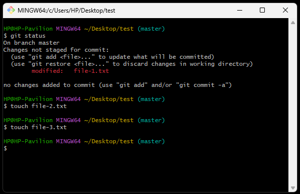

15. Check the status
    ```
    git status
    ```
    

16. Add all files at once
    ```
    git add .
    ```
    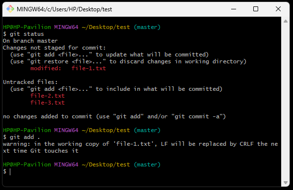

17. Check the status
    ```
    git status
    ```
    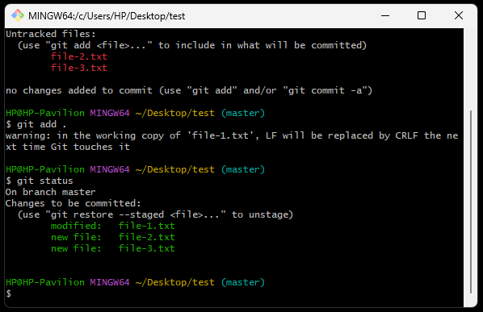

18. Commit the changes
    ```
    git commit -m "Added 2 new files and changed file-1.txt"
    ```
    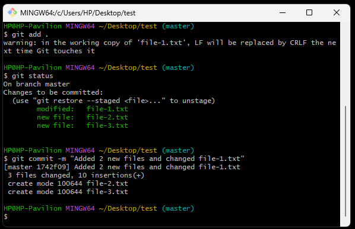

19. Check the status
    ```
    git status
    ```
    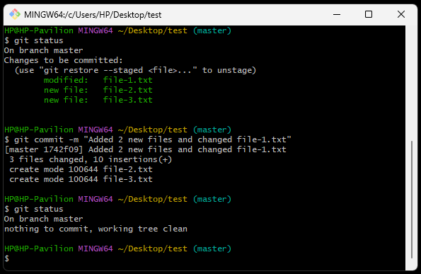

20. Remove file-3.txt
    ```
    rm -i file-3.txt
    ```
    Since we are using "-i", we will be asked whether we want this file to be deleted. 
    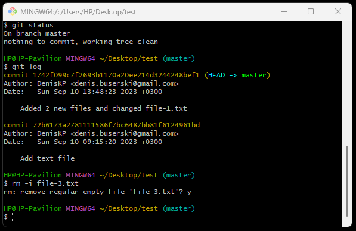

21. Check the status
    ```
    git status
    ```
    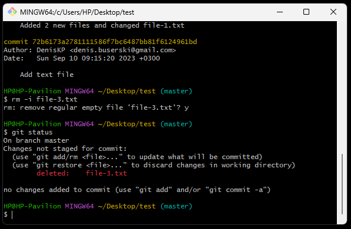

22. a
    
</details>
