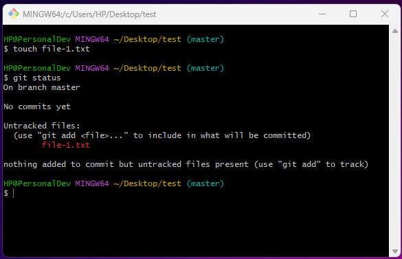
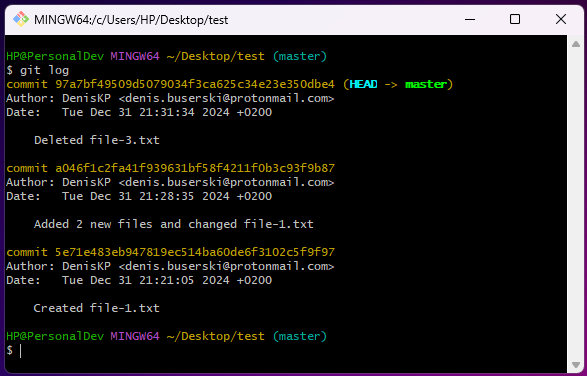
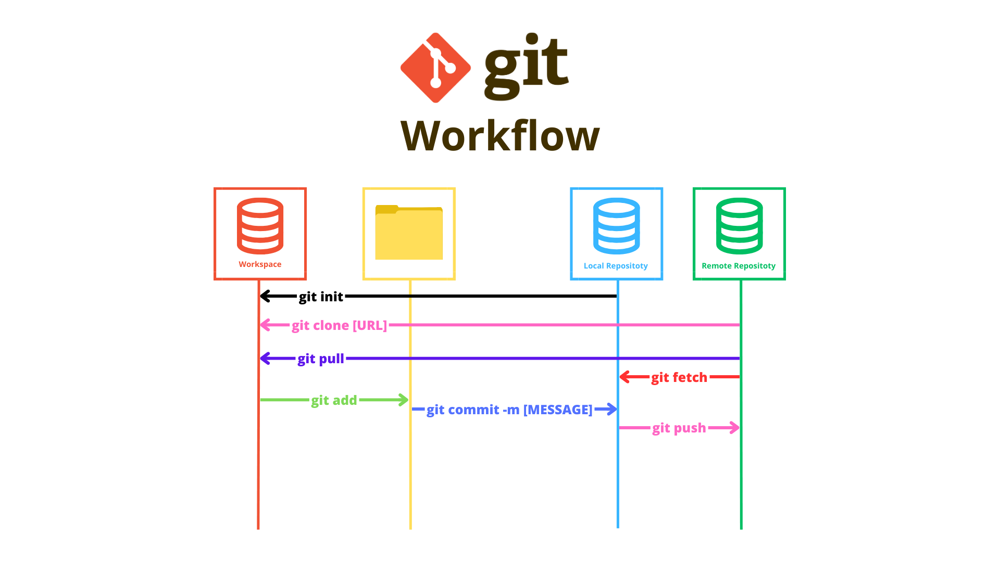

# How to use Git


## Overview

- Software Configuration Management(SCM) = Version Control(VS/VCS)
- Software principle
- When several programmers write code, the codes of which are then combined into 1 project. VC allows this to be more balanced and controls the whole process
- Keeps history of the made changes
- Conflict - When 2 people work on the same code and correct the same line
- Repository
  - The code repository used in a project
  - Project code    
- Open source code - Everyone can see the code
- GitHub - If you are not added as a collaborator, you cannot make pull requests

| Git        | GitHub  | Git Bash |
| ---------- | ------- | -------- |
| Version control | Portal | Client we use to upload code to GitHub |
| Methodology | | |


There are 2 types of Source-Control Systems 

| Distributed Source-Control System | Centralized Source-Control System |
| --------------------------------- | --------------------------------- |
| Git | SVN |
| 2 types of repository | |
| Remote - The main project from which the files are downloaded | Only 1 repository (Remote repository) |
| Local - Everyone involved in this project has 2 repositories | No Local repository |
| In case of conflict, the individual programmer can download the changes in his repository that the other has made and make the appropriate changes | Almost always we get conflicts and they are very hard to fix |


##

<details>
<summary><h2>Git commands</h2></summary>
<br>

Before following the below commands you would need to set Git with your GitHub profile. You can check [here](https://docs.github.com/en/get-started/getting-started-with-git/setting-your-username-in-git) how to do it.

1. Create a folder on your Desktop named "test"<br>
   Open `Git Bash` on your Desktop and create folder `test` with the `mkdir test` command.
   
2. Move to the `test` folder
   ```
   cd test
   ```
   
3. In the Git console write the command
   ```
   git init
   ```
   This command initializes a new, empty repository. Git creates a new `.git` directory in your project. Using the `ls -a` command we can see the mentioned directory.
   
4. Use the `clear` command to clear the console
5. Create `file-1.txt` in the `test` folder 
   ```
   touch file-1.txt
   ```
   
6. Check the status of your Working directory
   ```
   git status
   ```
   
   From the result, it can be seen that you don't have any commits and have 1 untracked file.
7. Move the file to the Staging area
   ```
   git add file-1.txt
   ```
8. Check the status
   

9. Commit the changes to you Local repository
   ```
   git commit -m"[Message]"
   ```
   ```
   git commit -m"Created file-1.txt"
   ```
   
10. Check the status
    
    When you see the above message, that means you are ready to the push the changes and add them to the Remote repository.
11. Add some text to file-1.txt
    ```
    echo "Sofia" >> file-1.txt
    ```
12. Check the status
    
    From the above message you can either prepare your changes for commit or discard the changes you have made.
    If you want to restore the previous state of the file you have to use:
    ```
    git restore file-1.txt
    ```
    If you want to keep the changes you made and prepare them for commit you have to use:
    ```
    git add file-1.txt
    ```
    With this command you can add 1 file at a time, but what if you have multiple...
13. Add 2 more files to the "test" folder
    ```
    touch file-2.txt
    touch file-3.txt
    ```
14. Check the status
    ```
    git status
    ```
    
15. Add all files at once
    ```
    git add .
    ```
    
16. Check the status
    
17. Commit the changes
    ```
    git commit -m"Added 2 new files and changed file-1.txt"
    ```
18. Check the status
    
19. Remove file-3.txt
    ```
    rm -i file-3.txt
    ```
    Since you are using `-i`, you will be asked whether you want this file to be deleted. 
    
20. Check the status
    
21. Prepare everything for commit and check the status
    ```
    git add .
    git status
    ```
    
22. Commit
    ```
    git commit -m "Deleted file-3.txt"
    ```
    
23. Check the history of your commits
    ```
    git log
    ```
    
24. Connect your Local repository with the one in GitHub


<br>

25. Connect your Local repository with the one in GitHub
    
    You need a repository in your GitHub. To create one follow the steps below:

    Step 1
    
    <kbd>  </kbd>

    Step 2
    
    <kbd>  </kbd>

    Step 3

    <kbd>  </kbd>

    Copy the URL of the repository and use the following command:
    ```
    git remote add origin [URL]
    ```
    ```
    git remote add origin https://github.com/DenisBuserski/test
    ```
    

    Move to your main branch:
    ```
    git checkout -b main
    ```
    

    Fetch the data from it:
    ```
    git fetch origin main
    ```
    

    Rebase:
    ```
    git rebase origin/main
    ```
    

    Push your changes:
    ```
    git push -u origin main
    ```
    

    After that you will see "file-1.txt" and "file-2.txt" in your GitHub repository.

26. There was a change in file-2.txt, which was not done by you. In this case you would need to take those changes on your side.

    Modify file-2.txt directly from GitHub. Follow bellow to see how:

    <kbd>  </kbd>

    <kbd>  </kbd>

    <kbd>  </kbd>

    After the file was changed you will pull those changes on your side:
    ```
    git pull
    ```
    This command takes the latest changes.
    
    

    Now when you have pulled the changes. You can check if file-2.txt is changed on your side:
    ```
    cat file-2.txt
    ```
    

27. Modify file-2.txt from GitHub and use: 
    ```
    git fetch
    ```
    Now you wil see what the difference between "pull" and "fetch" is.

    

    ```
    git diff main..origin/main
    ```
    

    You can see what changes were made to the file, before you pull those changes on your Local repository.

    ```
    git pull
    ```
    

    ```
    git status
    ```
    

28. What if you don't have the repository on your machine?
    Create a new folder on your Desktop named "Projects", right click on it "Open Git Bash here".
    ```
    git clone [URL]
    ```
    ```
    git clone https://github.com/DenisBuserski/test
    ```
    


<h3> You can check here a grafical explanation of some of the commands we used. </h3>

<kbd>  </kbd>
    
</details>


##

<details>
<summary><h2>How to use Git with Intellij</h2></summary>
<br>

Create a new repository on GitHub

<kbd>  </kbd>

Create a new project in IntelliJ

 

Select "Terminal"

 

 

Following you already know the Git commands:

 

 

 

 

Someone made some changes... Lets see them... 

 

You don't have this project on our PC...

<kbd>  </kbd>

<kbd>  </kbd>

 

 

</details>


##

<details>
<summary><h2>Additional information</h2></summary>
<br>

TEST

</details>


