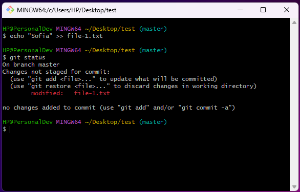
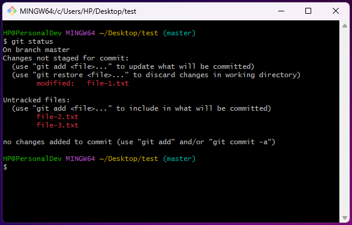
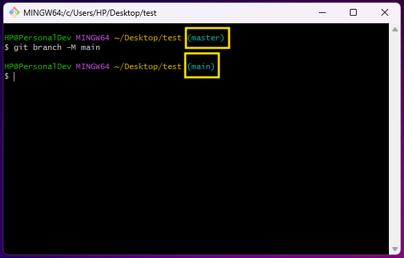

# How to use Git

## Overview
- Software Configuration Management(SCM) = Version Control(VS/VCS)
- Software principle
- When several programmers write code, the codes of which are then combined into 1 project. VC allows this to be more balanced and controls the whole process
- Keeps history of the made changes
- Conflict - When 2 people work on the same code and correct the same line
- Repository
  - The code repository used in a project
  - Project code    
- Open source code - Everyone can see the code
- GitHub - If you are not added as a collaborator, you cannot make pull requests

| Git                          | GitHub  | Git Bash |
|------------------------------| ------- | -------- |
| Version control; Methodology | Portal | Client we use to upload code to GitHub |

There are 2 types of Source-Control Systems 

| Distributed Source-Control System | Centralized Source-Control System |
| --------------------------------- | --------------------------------- |
| Git | SVN |
| 2 types of repository | |
| Remote - The main project from which the files are downloaded | Only 1 repository (Remote repository) |
| Local - Everyone involved in this project has 2 repositories | No Local repository |
| In case of conflict, the individual programmer can download the changes in his repository that the other has made and make the appropriate changes | Almost always we get conflicts and they are very hard to fix |


##

<details>
<summary><h2>Simple Git commands</h2></summary>
<br>

Before following the below commands you would need to set Git with your GitHub profile and a SSH key. <br>
For GitHub:
- [GitHub docs](https://docs.github.com/en/get-started/getting-started-with-git/setting-your-username-in-git) <br>

For SSH key:
- [GitHub docs](https://docs.github.com/en/authentication/connecting-to-github-with-ssh) 
- [🐱Generate a New SSH Key and Add it to your GitHub](https://www.youtube.com/watch?v=X40b9x9BFGo&list=PLN_xGGp_EzEJvRKWLk0EIRI6sfT36-ACm&index=3)

<br>

1. Create a folder on your Desktop named `test`<br>
   Open `Git Bash` on your Desktop and create a folder `test` with the `mkdir test` command.
2. Move to the `test` folder
   ```
   cd test
   ```
   
3. In the Git console write the command
   ```
   git init
   ```
   This command initializes a new, empty repository. Git creates a new `.git` directory in your project. Using the `ls -a` command we can see the mentioned directory.
   
4. Use the `clear` command to clear the console
5. Create `file-1.txt` in the `test` folder 
   ```
   touch file-1.txt
   ```
   
6. Check the status of your Working directory
   ```
   git status
   ```
   
   From the result, it can be seen that you don't have any commits and have 1 untracked file.
7. Move the file to the Staging area
   ```
   git add file-1.txt
   ```
8. Check the status
   
9. Commit the changes to you Local repository
   ```
   git commit -m"[Message]"
   ```
   ```
   git commit -m"Created file-1.txt"
   ```
   
10. Check the status
    
    When you see the above message, that means you are ready to the push the changes and add them to the Remote repository.
11. Add some text to file-1.txt
    ```
    echo "Sofia" >> file-1.txt
    ```
12. Check the status
    
    From the above message you can either prepare your changes for commit or discard the changes you have made.
    If you want to restore the previous state of the file you have to use:
    ```
    git restore file-1.txt
    ```
    If you want to keep the changes you made and prepare them for commit you have to use:
    ```
    git add file-1.txt
    ```
    With this command you can add 1 file at a time, but what if you have multiple...
13. Add 2 more files to the `test` folder
    ```
    touch file-2.txt
    touch file-3.txt
    ```
14. Check the status
    ```
    git status
    ```
    
15. Add all files at once
    ```
    git add .
    ```
    
16. Check the status
    
17. Commit the changes
    ```
    git commit -m"Added 2 new files and changed file-1.txt"
    ```
18. Check the status
    
19. Remove file-3.txt
    ```
    rm -i file-3.txt
    ```
    Since you are using `-i`, you will be asked whether you want this file to be deleted. 
    
20. Check the status
    
21. Prepare everything for commit and check the status
    ```
    git add .
    git status
    ```
    
22. Commit
    ```
    git commit -m"Deleted file-3.txt"
    ```
    
23. Check the history of your commits
    ```
    git log
    ```
    
24. Use the below command to rename the current branch to `main`
    ```
    git branch -M main
    ```
    
25. Create a repository on GitHub and connect it to your Local repository <br> 
    After you have created a repository on GitHub copy the below:
    
    ```
    git remote add origin [URL]
    ```
    ```
    git remote add origin git@github.com:DenisBuserski/test.git
    ```
26. Push your changes:
    ```
    git push -u origin main
    ```
    
    We can see the files in GitHub now.
    .png)
27. Add `README.md` in your Remote repository
    
    We don't have this `README.md` file in our Local repository, so let's get it.
    ```
    git fetch
    ```
    
    ```
    git merge
    ```
    

    ```
    git pull
    ```

    ```
    git merge
    ```
    
     ```
    git clone
    ```


<h3> You can check here a graphical explanation of some of the commands we used. </h3>

<kbd>  </kbd>
    
</details>


##

<details>
<summary><h2>Additional information</h2></summary>
<br>

[Git and Github Essentials](https://app.amigoscode.com/courses/enrolled/1317178) <br>
[Git and GitHub Tutorial For Beginners | Full Course [2021] [NEW]](https://www.youtube.com/watch?v=3fUbBnN_H2c&list=PLN_xGGp_EzEJvRKWLk0EIRI6sfT36-ACm&index=2&t=3156s) <br>
[Git Tutorial for Beginners: Learn Git in 1 Hour](https://www.youtube.com/watch?v=8JJ101D3knE&list=PLN_xGGp_EzEJvRKWLk0EIRI6sfT36-ACm&index=2) <br>
[Fundamentals with C#, Java, JS & Python Jan 21 - Git and GitHub - Kiril Kirilov](https://www.youtube.com/watch?v=LaWZYYuOkeM&list=PLN_xGGp_EzEJvRKWLk0EIRI6sfT36-ACm&index=2)<br>
[GitHub: The Right Way - Владимир Тасев](https://www.youtube.com/watch?v=kFuQ2f1qb_0&list=PLN_xGGp_EzEJvRKWLk0EIRI6sfT36-ACm&index=6&t=12s)

</details>


