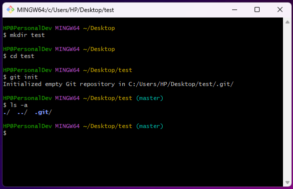

# Git


## Overview
- Software Configuration Management(SCM) = Version Control(VS/VCS)
- Software principle
- When several programmers write code, the codes of which are then combined into 1 project. VC allows this to be more balanced and controls the whole process
- Keeps history of the made changes
- Conflict - When 2 people work on the same code and correct the same line
- Repository
  - The code repository used in a project
  - Project code    
- Open source code - Everyone can see the code
- GitHub - If you are not added as a collaborator, you cannot make pull requests

| Git                          | GitHub   | Git Bash                               |
|------------------------------|----------|----------------------------------------|
| Version control; Methodology | Portal   | Client we use to upload code to GitHub |

There are 2 types of Source-Control Systems 

| Distributed Source-Control System                                                                                                                  | Centralized Source-Control System                            |
|----------------------------------------------------------------------------------------------------------------------------------------------------|--------------------------------------------------------------|
| Git                                                                                                                                                | SVN                                                          |
| 2 types of repository                                                                                                                              |                                                              |
| Remote - The main project from which the files are downloaded                                                                                      | Only 1 repository (Remote repository)                        |
| Local - Everyone involved in this project has 2 repositories                                                                                       | No Local repository                                          |
| In case of conflict, the individual programmer can download the changes in his repository that the other has made and make the appropriate changes | Almost always we get conflicts and they are very hard to fix |


## Simple Git commands

Before following the below commands you would need to set Git with your GitHub profile and a SSH key. <br>
For GitHub:
- [GitHub docs](https://docs.github.com/en/get-started/getting-started-with-git/setting-your-username-in-git) <br>

For SSH key:
- [GitHub docs](https://docs.github.com/en/authentication/connecting-to-github-with-ssh) 
- [🐱Generate a New SSH Key and Add it to your GitHub](https://www.youtube.com/watch?v=X40b9x9BFGo&list=PLN_xGGp_EzEJvRKWLk0EIRI6sfT36-ACm&index=3)

<br>

1. Create a folder on your Desktop named `test`<br>
   - Open `Git Bash` on your Desktop and create a folder `test` with the `mkdir test` command.
2. Move to the `test` folder - `cd test`
3. In the Git console write the command 
   ```
   git init
   ```
   This command initializes a new, empty repository. Git creates a new `.git` directory in your project. Using the 
   `ls -a` command we can see the mentioned directory.
   
4. Create `file-1.txt` in the `test` folder - `touch file-1.txt`
5. Check the status of your Working directory
   ```
   git status
   ```
    <br>
   From the result, it can be seen that you don't have any commits and have 1 untracked file.
6. Move the file to the Staging area
   ```
   git add file-1.txt
   ```
   
7. Commit the changes to you Local repository
   ```
   git commit -m"[MESSAGE]"
   
   git commit -m"Created file-1.txt"
   ```
    <br>
    When you see the above message, that means you are ready to the push the changes and add them to the Remote repository.
8. Add some text to `file-1.txt` - `echo "Sofia" >> file-1.txt`
    <br>
   From the above message you can either prepare your changes for commit or discard the changes you have made.
   
   | Restore the previous state of the file | Keep the changes you made and prepare them for commit  |
   |----------------------------------------|--------------------------------------------------------|
   | `git restore file-1.txt`               | `git add file-1.txt`                                   |

    With this command you can add 1 file at a time, but what if you have multiple...
9. Add 2 more files to the `test` folder
   
10. Add ALL files at once to the Staging area
    ```
    git add .
    ```
    
11. Commit the changes
    ```
    git commit -m"Added 2 new files and changed file-1.txt"
    ```
    
    
12. Remove `file-3.txt`
    ```
    rm -i file-3.txt
    ```
    
13. Prepare everything for commit 
    ```
    git add .
    ```
    
14. Commit
    ```
    git commit -m"Deleted file-3.txt"
    ```
    
15. Check the history of your commits
    ```
    git log
    ```
    
16. Use the below command to rename the current branch to `main`
    ```
    git branch -M main
    ```
    
17. Create a repository on GitHub and connect it to your Local repository <br> 
    After you have created a repository on GitHub copy the below:
    
    ```
    git remote add origin [URL]
    
    git remote add origin git@github.com:DenisBuserski/test.git
    ```
18. Push your changes:
    ```
    git push -u origin main
    ```
     <br>
    We can see the files in GitHub now.
    .png)
19. Add `README.md` in your Remote repository
     <br>
    We don't have this `README.md` file in our Local repository, so let's get it.
    
    | `git fetch`                                                                                | `git pull`                                                                                      | `git clone`                                                 |
    |--------------------------------------------------------------------------------------------|-------------------------------------------------------------------------------------------------|-------------------------------------------------------------|
    | Retrieves changes from a Remote repository without merging them into your Local repository | Fetches changes from a Remote repository and automatically merges them into your current branch | Creates a copy of a Remote repository on your Local machine |
    | When you want to merge the changes use `git merge`                                         | `git fetch` + `git merge`                                                                       | `git clone [URL]`                                           |


## Branches

| Command                                             | Description                        |
|-----------------------------------------------------|------------------------------------|
| `git branch`                                        | Show all branches                  |
| `git branch [BRANCH_NAME]`                          | Create branch                      |
| `git branch -m [BRANCH_NAME]`                       | Rename the current branch          |
| `git branch -m [OLD_BRANCH_NAME] [NEW_BRANCH_NAME]` | Rename branch you are not on       |
| `git branch -d [BRANCH_NAME]`                       | Delete branch                      |
| `git switch [BRANCH_NAME]`                          | Switch branch                      |
| `git checkout [BRANCH_NAME]`                        | Old way to switch branch           |
| `git checkout -b [BRANCH_NAME]`                     | Create new branch and switch to it |


## Additional information

[Git and Github Essentials](https://app.amigoscode.com/courses/enrolled/1317178) <br>
[Git and GitHub Tutorial For Beginners | Full Course [2021] [NEW]](https://www.youtube.com/watch?v=3fUbBnN_H2c&list=PLN_xGGp_EzEJvRKWLk0EIRI6sfT36-ACm&index=2&t=3156s) <br>
[Git Tutorial for Beginners: Learn Git in 1 Hour](https://www.youtube.com/watch?v=8JJ101D3knE&list=PLN_xGGp_EzEJvRKWLk0EIRI6sfT36-ACm&index=2) <br>
[Fundamentals with C#, Java, JS & Python Jan 21 - Git and GitHub - Kiril Kirilov](https://www.youtube.com/watch?v=LaWZYYuOkeM&list=PLN_xGGp_EzEJvRKWLk0EIRI6sfT36-ACm&index=2)<br>
[GitHub: The Right Way - Владимир Тасев](https://www.youtube.com/watch?v=kFuQ2f1qb_0&list=PLN_xGGp_EzEJvRKWLk0EIRI6sfT36-ACm&index=6&t=12s) <br>
[How to setup and use Git and GitHub with IntelliJ IDEA [2024] | Git | GitHub | IntelliJ](https://www.youtube.com/watch?v=qM5BScv1Z-s) <br>
[Git Explained in 100 Seconds](https://www.youtube.com/watch?v=hwP7WQkmECE) <br>
[Git Branches Tutorial](https://www.youtube.com/watch?v=e2IbNHi4uCI) <br>
[Git & GitHub Tutorial for Beginners #8 - Branches](https://www.youtube.com/watch?v=QV0kVNvkMxc)
[git with Intellij Idea](https://www.youtube.com/playlist?list=PLBb5HFCJVQtsCkbHJK7GWzjnAF00hfr8j)
